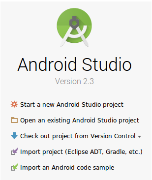
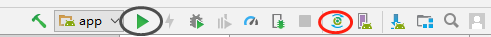
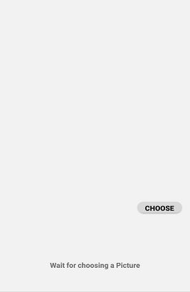

# README


## Tengine Android Classify Demo

###### This document describes a Classify image classification App based on the Tengine engine using the Tensorflow MobileNetv1 model. 


## Compile Android Tengine library 

###### If you are beginner and also your device based on Armv8, you can find libtengine.so  in ~\app\src\asset, which is only can run Tensorflow Model. 

###### If you want to run this Demo with other Models. Please refer to the [Android build](https://github.com/OAID/Tengine/blob/master/doc/build_android.md), for device on ARMv8 is Openblas V0.2.20 optional. After Step Build Tengine will generate a library file libtengine.so. in the Build folder. If you want to run this App on Armv7, you hat to Download Openblas V0.2.20  and you must set the correct BLAS_DIR in android_config.txt.  ComputeLibary is also optional, only if you want to run tengine with ACL GPU. About download and other details you can see in Android build.


## Upload Library of Tengine

###### Put libtengine.so in location ~\app\src\main\jnilibs\arm64-v8a. And upload MobileNet V1--image classification model and also the labels of MobileNet V1 on your devices. You can find label in ~\app\src\asset. You can find frozen_mobilenet_v1_224.pb in our [Tengine model zoo](https://pan.baidu.com/s/1LXZ8vOdyOo50IXS0CUPp8g#list/path=%2F) (psw:57vb)

``` ruby
adb devices
adb push mobilenet_deploy.prototxt /data/local/tmp/
adb push mobilenet.caffemodel /data/local/tmp/
adb push synset_words.txt /data/local/tmp/

```


## Install AndroidStudio 3.0+

###### If you don't have it installed already, go install [AndroidStudio 3.0+](https://developer.android.com/studio/). Then click Open an existing Android Studio project, choose Demo Tengine Classify.




## Gradle Sync and run app

###### Click first Sync then run.



## Install APKs and choose a Picture

###### Click choose Button, and choose a Picture.



Then this picture will show in App and it will be classified.


### This Demo is tested on Android 6, Android 7, and Android 8. Below Android 6 is not applicable.


